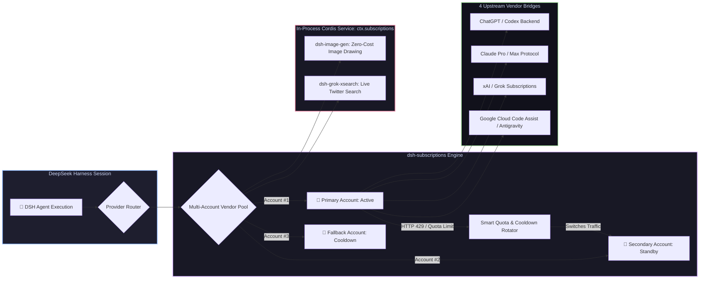

# 📦 @goodandready/dsh-subscriptions

<div align="center">

<h3>Personal AI Subscription Bridge, Multi-Account Pool Rotation & Zero-Leak OAuth for DeepSeek Harness</h3>

<p align="center">
  <a href="https://www.npmjs.com/package/@goodandready/dsh-subscriptions"></a>
  <a href="LICENSE"></a>
  <a href="https://github.com/topics/dsh-plugin"></a>
  <a href="https://nodejs.org"></a>
</p>

<p align="center">
  <a href="https://goodandready.app/"></a>
</p>

<p align="center">
  <a href="README.md"><b>🇬🇧 English</b></a> •
  <a href="README.ru.md"><b>🇷🇺 Русский</b></a> •
  <a href="README.zh.md"><b>🇨🇳 中文说明</b></a>
</p>

</div>

---

## ⚡ Overview

**`dsh-subscriptions`** bridges your paid personal AI subscriptions directly into **DeepSeek Harness** as first-class LLM providers.

Instead of burning expensive pay-as-you-go API credits for everyday agent tasks, `dsh-subscriptions` allows you to authenticate your existing web subscriptions via standard OAuth PKCE. It features **multi-account rotation pools** (automatically switching accounts when a rate limit or cooldown is reached), **preemptive quota switching**, and an **in-process Cordis service (`ctx.subscriptions`)** that safely powers sibling plugins like [`dsh-image-gen`](https://github.com/GooDAnDReaDY/dsh-image-gen) and [`dsh-grok-xsearch`](https://github.com/GooDAnDReaDY/dsh-grok-xsearch) with zero token leakage.



---

## ✨ Key Features & Capabilities

### 1. 🌐 16 Supported Built-in Subscription Vendors

| Vendor Key | Subscription Tier | Protocol & Features |
|---|---|---|
| `codex` | ChatGPT Plus / Pro | Codex streaming responses, tool calling & image drawing (`/backend-api/codex/...`) |
| `claude` | Claude Pro / Max | Native Claude Messages protocol, usage tracking (`/v1/messages`, `/api/oauth/...`) |
| `grok` | xAI / X Premium | Real-time reasoning responses, billing checks & social search |
| `antigravity` | Google Cloud Code Assist | Antigravity engine (`/v1/loadCodeAssist`, `/v1/streamGenerateContent`) |
| `kimi` | Moonshot Kimi | OAuth Device Flow login (`auth.kimi.com`), OpenAI-compatible chat |
| `glm` | Z.ai GLM Coding Plan | GLM coding endpoint (`api.z.ai`), live quota monitor (`/api/monitor/usage/quota/limit`) |
| `cursor` | Cursor | Cursor backend (`api2.cursor.sh`), billing-period usage dashboard parsing |
| `kiro` | AWS Kiro | Kiro desktop OAuth (`app.kiro.dev`), streaming code assistance |
| `copilot` | GitHub Copilot | GitHub Device Flow login (`github.com/login/device`), Copilot chat completions |
| `qwen` | Alibaba Qwen (DashScope) | OpenAI-compatible endpoint (`dashscope.aliyuncs.com/compatible-mode/v1`), API key auth |
| `ernie` | Baidu ERNIE (Qianfan) | OAuth2 token refresh via API Key + Secret Key, Wenxinworkshop chat |
| `spark` | iFlytek Spark | OpenAI-compatible Spark HTTP API (`spark-api-open.xf-yun.com/v1`) |
| `jetbrains` | JetBrains AI Assistant | JetBrains AI relay (`api.jetbrains.ai`) |
| `perplexity` | Perplexity Pro | Sonar model catalog (`api.perplexity.ai`) |
| `replit` | Replit Core | Replit AI API (`replit.com/api/v1/ai`), connect-token auth |
| `cody` | Sourcegraph Cody Pro | Sourcegraph API (`sourcegraph.com/.api`), access-token auth |

*Custom vendors can also be dynamically registered via the `createVendorFromProfile` factory.*

---

### 2. 🔄 Multi-Account Rotation & Rate-Limit Mitigation (`rotate.js`, `ratelimit.js`)
* **Multi-Account Pooling**: Attach multiple accounts per vendor (e.g. `CODEX_OAUTH_1`, `CODEX_OAUTH_2`, `CODEX_OAUTH_3`).
* **Automatic 429 Failover**: When an account encounters a rate limit (`HTTP 429`, `RATE_LIMIT`, `QUOTA_EXCEEDED`), traffic instantly fails over to the next healthy account in the pool.
* **Preemptive Quota Switching (`switchAtRemaining`)**: Automatically rotates to the next account before hitting zero if the rate-limit window reset is imminent.
* **Dynamic Cooldown Calculation**: Parses upstream headers (`Retry-After`, `x-ratelimit-reset`, ISO dates, epoch timestamps) and auto-restores cooled-down accounts when their window resets.

---

### 3. 🔒 Zero-Leak Credential Security & Headless OAuth
* **Zero Token Leakage**: OAuth tokens are **never** returned over HTTP API endpoints or rendered in the Web UI. The UI only receives masked account labels, connection health, and quota bars.
* **Secure Host Storage**: Tokens reside in encrypted `$DSH_HOME/.credentials.yaml` managed by the host credentials service.
* **Headless / Remote Login Fallback**: If running DSH on a headless server over SSH where browser popups cannot redirect to `localhost`, simply paste the redirected callback URL or authorization code directly into the account card.
* **Proactive Background Token Refresh**: Access tokens are refreshed automatically before expiration.

---

### 4. 🧩 In-Process Cordis Service (`ctx.subscriptions`)
Sibling plugins can tap into subscription capabilities directly in memory via Cordis:
```javascript
// Example in dsh-image-gen or custom plugins:
const res = await ctx.subscriptions.request('codex', '/backend-api/codex/images/generations', {
  method: 'POST',
  body: JSON.stringify({ prompt: 'Cyberpunk landscape', size: '1024x1024' }),
})
```
* **Zero Overhead**: Eliminates intermediate HTTP loops and keeps auth tokens strictly in-memory.
* **Strict Path Allowlist (`ALLOWLIST`)**: Restricts calls to verified vendor endpoints, preventing SSRF vulnerabilities.

---

### 5. 🔐 Login Without a Browser: Loopback & Device Code (`v0.4.9`)
* **Automatic Loopback Callback (`autoLoopback`, on by default)**: For vendors whose OAuth redirect URI is a loopback address (Codex `:1455`, Grok `:56121`), the plugin spins up a temporary local HTTP server and catches the callback by itself — no URL pasting needed. The paste fallback always stays available.
* **Device Code Login (Codex)**: On fully headless machines (no browser on any reachable host), use the **Device login** button in the Codex account card. The plugin requests a short user code from `auth.openai.com`, you open `https://auth.openai.com/codex/device` on any device, enter the code, and the plugin completes the standard PKCE exchange automatically.
* **Classic Fallbacks Intact**: Web-origin redirect (`useWebCallback`) and manual paste of the redirected URL / authorization code remain available for custom OAuth clients.

### 6. 🌍 Per-Account HTTP/SOCKS Proxy (`v0.4.9`)
* **Individual Proxy per Account (`proxyUrl`)**: Every account slot accepts its own proxy URL (`http://`, `https://`, `socks5://[user:pass@]host:port`). All requests for that account — OAuth token refresh, vendor checks, model requests — are routed through it. Empty = direct connection.
* **One-Click Proxy Check**: The account card has a **Check proxy** button: it performs a real request to the vendor base URL through the configured proxy and shows the round-trip latency or the failure reason.
* **Request History Timings**: Every recorded request now carries its duration (`ms`) in the history store, so you can compare direct vs proxied latency over time.

### 7. 🕶️ Privacy Masking & Diagnostics Report (`v0.4.9`)
* **Privacy Masking (`privacyMask`)**: One toggle in the settings card masks personal data across the whole UI: emails render as `j***n@example.com` everywhere (account lists, status labels, check results). Designed for screen sharing and streaming. Server-side masking means labels never leak through API responses either; the underlying account data is never overwritten.
* **Anonymized Diagnostics Report**: The settings card has a **Generate diagnostics report** block: one click fetches an anonymized report (plugin/runtime versions, OS, per-vendor health counters, aggregate HTTP status counts, last ≥400 errors with timings, non-secret settings) and copies it to the clipboard. Tokens, emails, credential refs and proxy URLs are strictly excluded (verified by tests).
* **Issue-Ready**: The same block links to the project issue tracker, so a bug report is: generate → paste → submit.

### 8. 🔌 HTTP API (added in `v0.4.9`)
| Route | Method | Purpose |
|---|---|---|
| `/dsh-subscriptions/diagnostics` | GET | Anonymized diagnostics report (no secrets, no tokens, no proxy URLs) |
| `/dsh-subscriptions/proxy-check` | POST | Latency check of a slot's proxy against its vendor base URL |
| `/dsh-subscriptions/oauth/device/start` | POST | Begin Codex device-code login (returns user code + verification URL) |
| `/dsh-subscriptions/oauth/device/poll` | POST | Poll device-code authorization status |

---

### 9. 🦛 Local Ollama Gateway & Seamless Fallback (`v0.4.17`)
* **Native Provider (`ollama`)**: When a local Ollama is reachable at `ollamaBaseUrl` (default `http://127.0.0.1:11434`), it appears in the native DSH model picker with the models discovered from `/api/tags`. No API key needed.
* **Seamless Quota Fallback (`ollamaFallback`, on by default)**: When every account of a provider is exhausted (or unreachable) and nothing has been streamed yet, the chat continues on a local model (`ollamaFallbackModel`, or the first model from `/api/tags`). The fallback is logged and recorded in request history as `kind: fallback`.
* **Free ($0) Emergency Path**: Works with no internet and no quota — ideal for offline demos.

### 10. ⚡ Reasoning Effort, Verbosity & Fast Mode (`v0.4.17`)
* **Reasoning Effort**: Codex models advertise their supported effort levels from the live catalog; the native picker validates and the chosen effort is transmitted as `reasoning.effort` in the Codex `/responses` protocol. Grok forwards effort with its own catalog-aware filtering.
* **Verbosity (`codexVerbosity`)**: `low` / `medium` / `high` is sent as `text.verbosity` for Codex reasoning models. Empty = protocol default.
* **Fast Mode (`codexFastMode`)**: Sends `service_tier: priority` (1.5x speed billing tier) with every Codex request. The active-subscription chip shows a `⚡` prefix while enabled.

### 11. 🚦 Family-Scoped Cooldowns & Model Filtering (`v0.4.17`)
* **Reasoning vs Standard**: A 429 on a reasoning model (claude `*thinking*`, grok `*reasoning*`, all codex models) cools down only the reasoning family of that account — standard models on the same account keep working immediately. Legacy cooldowns (from older versions) still block the whole account until expiry.
* **Hide Deprecated Models (`hideDeprecatedModels`)**: Filters `test`/`preview`/`dev`/`alpha`/`beta`/`legacy` model ids out of the native picker (applies to live catalogs and the static fallback).

---

### 12. 🧯 Safe Reset Credits (`v0.4.18`)
* **Reset Card Visibility**: The Codex account card shows how many ChatGPT quota reset cards are available and when the earliest one expires.
* **Deliberate Confirmation Flow**: Consuming a card requires an explicit checkbox ("I understand one attempt will be consumed") plus a mandatory 5-second cooldown before the Reset button activates.
* **Double-Click Proof**: A host-side single-flight gate (synchronous pending lock before the first network await) makes it impossible for a double click or a concurrent call to consume two cards. Uncertain network results return the challenge to "prepared" for a safe retry of the same request.
* **Honest Results**: Server verdicts are shown verbatim: `reset` / `nothing to reset` (nothing consumed) / `no usable credit` / `already redeemed`.

### 13. 📊 Composer Quota Indicator & Runway Forecast (`v0.4.18`)
* **Placement**: Renders in the input area next to the model switcher (`conversation.input.right` slot).
* **Four display modes (`composerQuota` setting)**: `off` / `percent` (`85%`) / `bar` (40px mini bar, green>30 / amber 10-30 / red <10) / `forecast`.
* **Runway Forecast**: A sliding 24h window of remaining-percent samples (up to 192 points) feeds a recency-weighted least-squares burn rate; below 30 min of observation or <1% consumed it stays `calibrating…`, with no consumption it says `no usage`. Ready state shows `~4.5h` / `~12m`.
* **Auto-Hide**: No indicator for local Ollama or when nothing is active.

### 14. 🧑‍💻 SUBS Pill & Session Console (`v0.4.18`)
* **Pill in the Session Header**: `SUBS (N)` in the session header actions area with a pool-health LED: green <50% max usage, amber 50-90%, red ≥90%, gray when nothing is connected.
* **Modal Console**: Clicking the pill opens an in-session modal listing every account (provider #index, connected/not, cooldown, quota %) and a shortcut to the settings card. Closes on outside click, ✕ or Escape.

### 15. 🫧 Draggable HUD Widget (`v0.4.18`)
* **Floating Bubble** on `shell.overlay`: a 64px circle with an SVG ring gauge of the active subscription balance, mounted via `createPortal`.
* **Drag & Dock**: Drag anywhere; it snaps to any screen edge within 24px (peek-style half-hidden until hovered) and remembers its position in `localStorage`.
* **Frosted Panel**: Hovering reveals a `backdrop-filter: blur(28px)` panel listing every account with usage bars. Clicking the bubble refreshes quota data; data also refreshes every 60 s.
* **Settings Card Polish (`v0.4.18`)**: Chevron switched to the core `IconChevronDownOutline14` primitive; explicit settings snapshot states (loading / unavailable + Retry) guard against phantom input.

### 16. ⚡ ClineBot-Inspired UI & Hardened Telemetry (`v0.6.6`)
* **Live Status Badge Bar**: Instant latency check to the host (`Host online (XX ms)`), real-time connected account indicators, and pool size at a glance.
* **One-Click Smoke Test (Ping)**: Test live connectivity to the active upstream subscription provider and measure real round-trip latency.
* **Session Telemetry Dashboard**: Visual stat cards displaying successful/total requests, average latency, session success rate, and last request activity.
* **Curated Models Catalog**: Quick preview of supported model families with context windows and capability tags (Vision, Reasoning, Hybrid).
* **Non-Blocking Storage**: `HistoryStore` debounces disk persistence asynchronously to prevent blocking the Node.js event loop during high-throughput streaming.

---

## 📦 Quick Installation

```bash
dsh plugin --profile web add @goodandready/dsh-subscriptions
```

> [!IMPORTANT]
> Restart DSH Web UI after installation (`systemctl --user restart dsh-web`) and navigate to **Settings → Plugins → Plugin Settings → Subscriptions** to link your accounts.

---


> [!TIP]
> **UI Settings Card vs YAML Overrides**:
> All common options (account slots, autoLoopback, privacyMask, composerQuota, expiryNotifyDays, codexFastMode, codexVerbosity, ollamaFallback/baseUrl/model, and cooldown/probe intervals) can be managed directly in the Web UI card (**Settings → Plugins → Plugin Settings → Subscriptions**). Low-level parameters such as OAuth client IDs/redirect URIs, API base URL overrides, and custom vendors are configured in `settings.yaml`.

## ⚙️ Configuration Reference (`settings.yaml`)

```yaml
dsh-subscriptions:
  switchAtRemaining: 1
  cooldownMs: 60000
  autoLoopback: true        # v0.4.9: catch loopback OAuth callbacks automatically
  privacyMask: false        # v0.4.9: mask emails and account identifiers in the UI
  ollamaBaseUrl: http://127.0.0.1:11434  # v0.4.17: local Ollama gateway
  ollamaFallback: true      # v0.4.17: seamless fallback when all accounts are exhausted
  ollamaFallbackModel: ''   # v0.4.17: e.g. qwen2.5-coder; empty = first model from /api/tags
  hideDeprecatedModels: false # v0.4.17: filter test/preview/beta/legacy model ids
  codexVerbosity: ''        # v0.4.17: low | medium | high (text.verbosity)
  codexFastMode: false      # v0.4.17: service_tier priority (1.5x speed tier)
  composerQuota: 'off'      # v0.4.18: composer indicator: off | percent | bar | forecast
  # Per-slot fields (v0.4.9): expiresAt (ms epoch), proxyUrl (http/https/socks5://)
  accounts:
    codex:
      - ref: CODEX_OAUTH_1
        label: "Work Pro Account"
      - ref: CODEX_OAUTH_2
        label: "Personal Plus Account"
    claude:
      - ref: CLAUDE_OAUTH_1
        label: "Claude Max"
    grok:
      - ref: GROK_OAUTH_1
        label: "X Premium"
```

---

## 🧠 Claude Adaptive Thinking & Effort (Added in v0.6.7)

Supports Anthropic's adaptive thinking (`thinking: { type: "adaptive" }`) and reasoning effort steering (`output_config: { effort }`):
- **Model Support**: Automatically gates effort levels for Opus 4.6+, Opus 4.7+, Opus 5 (`low`, `medium`, `high`, `xhigh`, `max`) and Sonnet 4.6+, Sonnet 5 (`low`, `medium`, `high`).
- **Safe Fallback**: Models that do not support adaptive thinking (Haiku, Fable, 4.5 and earlier) reject the parameter cleanly and leave requests unaugmented to prevent 400 Bad Request API errors.
- **Dynamic Catalog**: The provider model catalog exports matching `reasoning.efforts` options to the DeepSeek Harness interface.

---

## 🌐 Full Bilingual Localization (EN / ZH) & Account Health (Added in v0.6.8)

- **Strict Localization Standards**: Built-in UI dictionary is now 100% bilingual with complete English (`en`) and Simplified Chinese (`zh`) translation dictionaries and instruction guides.
- **Decoupled Translations**: Russian and other localized translations are provided at runtime via standalone dictionary packages (such as `dsh-russian-lang`), leaving the core plugin codebase lean and zero-hardcoded.
- **Per-Account Health & Latency Probe**: The slot check button now records live upstream round-trip latency (`latencyMs`) for each individual subscription account slot.

---

## 🚀 One-Click Plugin Updater & Stability Hardening (Added in v0.6.9)

- **Host One-Click Updater**: Automatic in-place updater mounted at `/dsh-subscriptions/update`, checking the npm registry for newer releases and executing single-flight installation via the host DSH CLI (`dsh plugin add --config.minimumReleaseAge=0`).
- **Security & Origin Protection**: Updater endpoints enforce strict loopback address checks (supporting IPv4 `127.0.0.1`, IPv6 `::1`, `localhost`), `x-dsh-plugin-update` header verification, and same-origin validation to prevent unauthorized updates.
- **Header Badge & UI Action**: The settings header bar displays current plugin version, an update warning badge when a new release is detected, and an instant "Update" button with live restart countdown.
- **Network Timeout Hardening**: Quota balance and smoke test probes now enforce guaranteed 15-second abort timeouts (`AbortSignal.timeout(15_000)`), preventing hanging sockets during vendor outages.
- **Parameter Normalization & Deduplication**: Unified support for `provider || vendor` and `index || accountIndex` aliases in check endpoints, and deduplicated threshold notification loops.

---

---

## 🛡️ Token Usage Normalization & Session Projection Fix (Added in v0.6.12)

- **Session Projection Fix (GitHub #4)**: Fixed an issue where ChatGPT Codex and other streaming provider responses caused DSH session recovery to fail on page reload with `received NaN, expected number on uncachedInputTokens and outputTokens`.
- **Canonical `TokenUsage` Normalization**: Introduced `toTokenUsage()` across all streaming pipelines (`codexResponsesStream`, `openaiChatStream`, `anthropicStream`, and `googleStream`) to map raw vendor usage payloads into canonical DSH `TokenUsage` (`inputTokens`, `outputTokens`, `cacheReadTokens`, `cacheWriteTokens`, `reasoningTokens`, `totalTokens`).
- **Strict Integer Guard**: All token counts are strictly guarded to non-negative finite integers (guaranteeing `0` fallback, never `NaN` or `undefined`). Disjoint uncached token calculation is performed when cached tokens are folded into prompt totals.
- **Defense in Depth**: Added adapter-level stream validation in `SubscriptionAdapter` to prevent malformed or invalid token usage chunks from ever reaching DSH session persistence.

---

## 🔒 OAuth Client Validation & Route Updates (Added in v0.6.11)

- **OAuth Client ID Guard (GitHub #2)**: uildAuthorizeUrl and ntigravity.authorizeUrl now strictly require a non-empty clientId. If unconfigured, the endpoint returns an explicit HTTP 400 (missing_client_id) and the UI prompts the user to configure ntigravityClientId in plugin settings or use "From CLI" instead of directing the browser to a failing Google OAuth page.
- **Config Schema Secret Key**: Added ntigravityClientSecret to the plugin configuration schema, allowing convenient entry of private client secrets alongside ntigravityClientId with automatic masking in public endpoints.
- **Zhipu GLM Console Route Migration (GitHub #3)**: Updated the Zhipu GLM authorization and API key center link to the active console route (https://bigmodel.cn/usercenter/proj-mgmt/apikeys), eliminating 404 navigation errors caused by vendor console restructuring.

---

## 🛡️ Reliability & Quality Hardening (Added in v0.6.10)

- **Structured Error Handling**: Eliminated all empty catch blocks across the plugin runtime via safe `bestEffort` helper logging debug diagnostics.
- **Native Context Logger**: Migrated all plugin logging to the canonical Cordis `ctx.logger('subscriptions')` subsystem.
- **Network Timeout Protection**: Hardened external vendor API calls (`listModels`, `fetchFor`, `quotaFetch`, `jsonTokenRequest`) with explicit `fetchWithTimeout` and `AbortSignal.timeout` safeguards.
- **Design System Theming**: Replaced hardcoded styling values with native DeepSeek Harness CSS theme tokens (`--dsw-alias-*`, `color-mix`), achieving 100% theme token coverage and zero standalone `rgba` values.
- **Client Dependency Injections**: Explicitly declared required client platform dependencies (`@deepseek-ai/dsh-client-locale`, `@deepseek-ai/dsh-client-ui-slots`) in package manifest.
- **Strict Repository Hygiene**: Removed internal development instructions and planning artifacts from git tracking, enforcing clean public releases.

---

## 🌐 Localization

The plugin source language is English only. Russian and other translations are provided at runtime by separate language plugins (for example the russification plugin), which translate the registered locale keys - the package itself ships no bundled translations (Changed in 0.6.1).

---

## 📄 License

MIT © [GooDAnDReaDY](https://github.com/GooDAnDReaDY)

This fork coexists with dsh-plugin-subscriptions. Its model routes use the subscriptions- prefix, its Settings entry is Extended subscriptions, and credentials stay in its own credential store. Claude requests omit mcp_probe. Shared account management requires an administrator on the deployed password gateway. Fork builds (`-dsh.` versions) install from a local tarball, so the one-click updater reports the current version only and never installs the upstream npm release.
