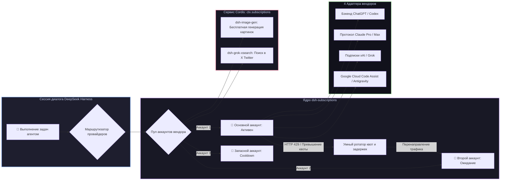

# 📦 @goodandready/dsh-subscriptions

<div align="center">

<h3>Мост персональных подписок на ИИ, ротация пула аккаунтов и безопасный OAuth без утечки токенов для DeepSeek Harness</h3>

<p align="center">
  <a href="https://www.npmjs.com/package/@goodandready/dsh-subscriptions"></a>
  <a href="LICENSE"></a>
  <a href="https://github.com/topics/dsh-plugin"></a>
  <a href="https://nodejs.org"></a>
</p>

<p align="center">
  <a href="https://goodandready.app/"></a>
</p>

<p align="center">
  <a href="README.md"><b>🇬🇧 English</b></a> •
  <a href="README.ru.md"><b>🇷🇺 Русский</b></a> •
  <a href="README.zh.md"><b>🇨🇳 中文说明</b></a>
</p>

</div>

---

## ⚡ Обзор

**`dsh-subscriptions`** подключает ваши платные персональные подписки на нейросети напрямую в **DeepSeek Harness** в качестве полноценных LLM-провайдеров.

Вместо поминутной оплаты дорогих API-ключей для повседневных задач агента, плагин позволяет авторизовать ваши существующие веб-подписки через безопасный протокол OAuth PKCE. Поддерживаются **пулы из нескольких аккаунтов** с автоматической ротацией при исчерпании лимитов, **упреждающее переключение квот** и **внутрипроцессный сервис Cordis (`ctx.subscriptions`)**, который питает соседние плагины (например, [`dsh-image-gen`](https://github.com/GooDAnDReaDY/dsh-image-gen) и [`dsh-grok-xsearch`](https://github.com/GooDAnDReaDY/dsh-grok-xsearch)) без утечки токенов в сеть.



---

## ✨ Ключевые возможности

### 1. 🌐 16 Поддерживаемых встроенных вендоров подписок

| Ключ вендора | Тариф подписки | Протокол и возможности |
|---|---|---|
| `codex` | ChatGPT Plus / Pro | Стриминг Codex, вызов инструментов и генерация картинок (`/backend-api/codex/...`) |
| `claude` | Claude Pro / Max | Нативный протокол Claude Messages, трекинг расхода (`/v1/messages`, `/api/oauth/...`) |
| `grok` | xAI / X Premium | Ответы с рассуждениями, проверка баланса и поиск в соцсети |
| `antigravity` | Google Cloud Code Assist | Движок Antigravity (`/v1/loadCodeAssist`, `/v1/streamGenerateContent`) |
| `kimi` | Moonshot Kimi | Вход по OAuth Device Flow (`auth.kimi.com`), OpenAI-совместимый чат |
| `glm` | Z.ai GLM Coding Plan | Кодинг-эндпоинт GLM (`api.z.ai`), живой монитор квоты (`/api/monitor/usage/quota/limit`) |
| `cursor` | Cursor | Бэкенд Cursor (`api2.cursor.sh`), разбор дашборда расхода за период |
| `kiro` | AWS Kiro | Десктопный OAuth Kiro (`app.kiro.dev`), стриминг кода |
| `copilot` | GitHub Copilot | Вход по GitHub Device Flow (`github.com/login/device`), chat completions Copilot |
| `qwen` | Alibaba Qwen (DashScope) | OpenAI-совместимый эндпоинт (`dashscope.aliyuncs.com/compatible-mode/v1`), вход по API-ключу |
| `ernie` | Baidu ERNIE (Qianfan) | Продление OAuth2-токена по связке API Key + Secret Key, чат Wenxinworkshop |
| `spark` | iFlytek Spark | OpenAI-совместимый HTTP API Spark (`spark-api-open.xf-yun.com/v1`) |
| `jetbrains` | JetBrains AI Assistant | Релей JetBrains AI (`api.jetbrains.ai`) |
| `perplexity` | Perplexity Pro | Каталог моделей Sonar (`api.perplexity.ai`) |
| `replit` | Replit Core | Replit AI API (`replit.com/api/v1/ai`), вход по connect-токену |
| `cody` | Sourcegraph Cody Pro | Sourcegraph API (`sourcegraph.com/.api`), вход по access-токену |

*Также поддерживается регистрация кастомных вендоров через фабрику профилей `createVendorFromProfile`.*

---

### 2. 🔄 Ротация аккаунтов и защита от лимитов (`rotate.js`, `ratelimit.js`)
* **Пулы из нескольких аккаунтов**: привязка нескольких аккаунтов на вендора (`CODEX_OAUTH_1`, `CODEX_OAUTH_2`...).
* **Автоматическое переключение при 429**: при превышении лимита запросов трафик мгновенно переключается на следующий свободный аккаунт.
* **Упреждающее переключение квот (`switchAtRemaining`)**: смена аккаунта до падения в ошибку, если окно сброса близко.
* **Динамический расчёт Cooldown**: парсинг заголовков `Retry-After`, `x-ratelimit-reset`, дат ISO и миллисекундных меток с автоматическим возвратом остывших аккаунтов в строй.

---

### 3. 🔒 Безопасность и авторизация на headless-серверах
* **Нулевая утечка токенов**: токен OAuth **никогда** не отдаётся в браузер или через публичный HTTP API. В интерфейсе видны только статус, имя и остаток квоты.
* **Хранилище хоста**: токены шифруются в `$DSH_HOME/.credentials.yaml`.
* **Вход без браузера (SSH / Remote)**: если сервер запущен удалённо, авторизацию можно завершить, просто вставив итоговый redirect URL или authorization code в карточку аккаунта.
* **Фоновое продление токенов**: плагин автоматически обновляет токены до истечения их срока действия.

---

### 4. 🧩 Внутрипроцессный сервис Cordis (`ctx.subscriptions`)
Другие плагины могут использовать подключенные подписки напрямую в памяти:
```javascript
// Пример вызова из dsh-image-gen:
const res = await ctx.subscriptions.request('codex', '/backend-api/codex/images/generations', {
  method: 'POST',
  body: JSON.stringify({ prompt: 'Cyberpunk landscape', size: '1024x1024' }),
})
```
* **Нулевой оверхед**: прямое общение без лишних HTTP-запросов.
* **Белый список путей (`ALLOWLIST`)**: строгий контроль вызываемых эндпоинтов для защиты от SSRF.

---

### 5. 🔐 Вход без браузера: loopback и device-код (`v0.4.9`)
* **Автоматический loopback-callback (`autoLoopback`, включён по умолчанию)**: если redirect_uri вендора — loopback-адрес (Codex `:1455`, Grok `:56121`), плагин сам поднимает временный локальный HTTP-сервер и ловит callback без ручной вставки ссылки. Ручная вставка остаётся как запасной путь.
* **Вход по коду устройства (Codex)**: на полностью headless-машинах нажмите **Device login** в карточке аккаунта Codex: плагин запросит короткий код на `auth.openai.com`, вы открываете `https://auth.openai.com/codex/device` с любого устройства, вводите код — плагин сам завершает стандартный PKCE-обмен.
* **Классические варианты на месте**: redirect на origin веб-интерфейса (`useWebCallback`) и ручная вставка адреса/кода доступны как раньше.

### 6. 🌍 Индивидуальный HTTP/SOCKS-прокси на аккаунт (`v0.4.9`)
* **Прокси на слот (`proxyUrl`)**: каждый аккаунт принимает свой адрес `http://`, `https://`, `socks5://[user:pass@]host:port`. Через него идут все запросы аккаунта — обновление токенов, проверки вендора, запросы моделей. Пусто = прямое соединение.
* **Проверка в один клик**: кнопка **Check proxy** в карточке аккаунта делает реальный запрос к базовому URL вендора через прокси и показывает задержку или причину отказа.
* **Тайминги в истории**: каждая запись истории запросов теперь содержит длительность (`ms`) — удобно сравнивать прямое соединение и прокси.

### 7. 🕶️ Режим приватности и диагностический отчёт (`v0.4.9`)
* **Маскирование (`privacyMask`)**: один тумблер в карточке настроек скрывает персональные данные во всём интерфейсе: email отображается как `j***n@example.com` (списки аккаунтов, статусы, результаты проверок). Маскирование выполняется на сервере — личные данные не утекут и через ответы API; сами данные аккаунтов при этом не перезаписываются. Задумано для демонстраций экрана и стримов.
* **Анонимизированный диагностический отчёт**: блок **Generate diagnostics report**: один клик — отчёт (версии плагина/рантайма, ОС, счётчики здоровья по вендорам, агрегаты HTTP-статусов, последние ошибки ≥400 с таймингами, не-секретные настройки) скачан и скопирован в буфер. Токены, email, имена учётных записей и адреса прокси исключены (покрыто тестами).
* **Готово для issue**: рядом ссылка на трекер задач — баг-репорт это «сгенерировать → вставить → отправить».

### 8. 🔌 HTTP API (добавлено в `v0.4.9`)
| Маршрут | Метод | Назначение |
|---|---|---|
| `/dsh-subscriptions/diagnostics` | GET | Анонимизированный диагностический отчёт (без секретов, токенов и адресов прокси) |
| `/dsh-subscriptions/proxy-check` | POST | Проверка задержки прокси слота через базовый URL вендора |
| `/dsh-subscriptions/oauth/device/start` | POST | Начать вход Codex по коду устройства (возвращает код и адрес подтверждения) |
| `/dsh-subscriptions/oauth/device/poll` | POST | Опрос статуса авторизации по коду устройства |

---

### 9. 🦛 Локальный шлюз Ollama и бесшовный фолбэк (`v0.4.17`)
* **Нативный провайдер (`ollama`)**: если локальный Ollama доступен по `ollamaBaseUrl` (по умолчанию `http://127.0.0.1:11434`), он появляется в нативном селекторе моделей DSH с моделями из `/api/tags`. Ключ не нужен.
* **Бесшовный фолбэк (`ollamaFallback`, включён по умолчанию)**: когда все аккаунты провайдера исчерпаны (или недоступны) и ещё ничего не выведено, чат продолжается на локальной модели (`ollamaFallbackModel`, либо первая из `/api/tags`). Фолбэк пишется в журнал и в историю запросов как `kind: fallback`.
* **Бесплатный ($0) аварийный путь**: работает без интернета и без квот — удобно для офлайн-демо.

### 10. ⚡ Effort, Verbosity и Fast Mode (`v0.4.17`)
* **Уровень рассуждений (Effort)**: модели Codex объявляют поддерживаемые уровни из живого каталога; нативный селектор валидирует выбор, и выбранный уровень передаётся как `reasoning.effort` в протокол `/responses`. Grok передаёт effort со своей каталог-осознанной фильтрацией.
* **Детализация (`codexVerbosity`)**: `low` / `medium` / `high` передаётся как `text.verbosity` для reasoning-моделей Codex. Пусто = дефолт протокола.
* **Fast Mode (`codexFastMode`)**: c каждым Codex-запросом передаётся `service_tier: priority` (платный скоростной тир 1.5x). В чипе активной подписки при включённом режиме отображается `⚡`.

### 11. 🚦 Кулдауны по семействам и фильтрация моделей (`v0.4.17`)
* **Reasoning vs Standard**: 429 на reasoning-модели (claude `*thinking*`, grok `*reasoning*`, все codex-модели) охлаждает только семейство reasoning этого аккаунта — standard-модели того же аккаунта продолжают работать. Legacy-кулдауны (от старых версий) по-прежнему блокируют весь аккаунт до истечения.
* **Скрыть устаревшие модели (`hideDeprecatedModels`)**: убирает из нативного селектора id с `test`/`preview`/`dev`/`alpha`/`beta`/`legacy` (действует и на живые каталоги, и на статичный фолбэк).

### 12. ⚡ Дизайн в стиле ClineBot и неблокирующая телеметрия (`v0.6.6`)
* **Строка статуса с бейджами**: Мгновенный замер задержки хоста (`Host online (XX ms)`), количество активных подключений и размер пула.
* **Интерактивный Smoke Test (Ping)**: Проверка связи с провайдером в один клик с измерением реального времени отклика в миллисекундах.
* **Панель телеметрии сессии**: 4 карточки метрик (успешных/всего запросов, средняя задержка, процент успешности, последняя активность).
* **Каталог моделей подписок**: Компактный список поддерживаемых моделей с размером контекста (128k, 200k, 1M) и тегами возможностей.
* **Асинхронная история**: Неблокирующий дебаунсинг записи `HistoryStore`, исключающий просадки event loop при интенсивном стриминге.

---

## 📦 Быстрая установка

```bash
dsh plugin --profile web add @goodandready/dsh-subscriptions
```

---


> [!TIP]
> **Карточка настроек в UI vs Настройки в YAML**:
> Все основные параметры (слоты аккаунтов, перехват autoLoopback, privacyMask, индикатор composerQuota, оповещение expiryNotifyDays, codexFastMode, codexVerbosity, ollamaFallback/baseUrl/model, интервалы cooldown и probe) настраиваются напрямую в Web UI: **«Настройки → Плагины → Настройки плагинов → Subscriptions»**. Низкоуровневые оверрайды (собственные OAuth Client ID / Redirect URI, Base URL для прокси, кастомные вендоры) задаются в `settings.yaml`.

## ⚙️ Пример конфигурации (`settings.yaml`)

```yaml
dsh-subscriptions:
  switchAtRemaining: 1
  cooldownMs: 60000
  autoLoopback: true        # v0.4.9: автоматически ловить loopback-callback
  privacyMask: false        # v0.4.9: маскировать email и учётные записи в UI
  ollamaBaseUrl: http://127.0.0.1:11434  # v0.4.17: локальный шлюз Ollama
  ollamaFallback: true      # v0.4.17: бесшовный фолбэк при исчерпании всех аккаунтов
  ollamaFallbackModel: ''   # v0.4.17: например qwen2.5-coder; пусто = первая модель из /api/tags
  hideDeprecatedModels: false # v0.4.17: фильтровать test/preview/beta/legacy id моделей
  codexVerbosity: ''        # v0.4.17: low | medium | high (text.verbosity)
  codexFastMode: false      # v0.4.17: service_tier priority (скоростной тир 1.5x)
  composerQuota: 'off'      # v0.4.18: индикатор в строке ввода: off | percent | bar | forecast
  # Поля слота (v0.4.9): expiresAt (ms), proxyUrl (http/https/socks5://)
  accounts:
    codex:
      - ref: CODEX_OAUTH_1
        label: "Рабочий Pro-аккаунт"
      - ref: CODEX_OAUTH_2
        label: "Личный Plus-аккаунт"
    claude:
      - ref: CLAUDE_OAUTH_1
        label: "Claude Max"
    grok:
      - ref: GROK_OAUTH_1
        label: "X Premium"
```

---

## 🧠 Адаптивное мышление Claude и уровни усилия (Добавлено в v0.6.7)

Поддержка адаптивного мышления Anthropic (`thinking: { type: "adaptive" }`) и управления глубиной рассуждений (`output_config: { effort }`):
- **Поддержка моделей**: Автоматическое определение уровней усилия для Opus 4.6+, Opus 4.7+, Opus 5 (`low`, `medium`, `high`, `xhigh`, `max`) и Sonnet 4.6+, Sonnet 5 (`low`, `medium`, `high`).
- **Безопасный фоллбэк**: Модели без поддержки адаптивного рассуждения (Haiku, Fable, 4.5 и старше) не перегружаются параметрами во избежание ошибок Anthropic API (400 Bad Request).
- **Динамический каталог**: В каталоге моделей регистрируется секция `reasoning.efforts`, доступная для выбора в интерфейсе DeepSeek Harness.

---

## 🌐 Двуязычная локализация (EN / ZH) и проверка здоровья аккаунтов (Добавлено в v0.6.8)

- **Стандарты локализации**: Встроенный интерфейс стал на 100% двуязычным — предоставлены полные словари и инструкции на английском (`en`) и упрощенном китайском (`zh`) языках.
- **Внешняя русификация**: Русские строки полностью отделены от исходного кода плагина и подключаются динамически через официальный плагин русификации (`dsh-russian-lang`).
- **Индивидуальная проверка аккаунта**: Кнопка проверки в карточке слота измеряет фактическую задержку (`latencyMs`) и статус здоровья выбранного аккаунта.

---

## 🚀 Обновление в один клик и повышение стабильности (Добавлено в v0.6.9)

- **Встроенный апдейтер в один клик**: Фоновая проверка новых версий в npm registry и обновление на месте по маршруту `/dsh-subscriptions/update` через хостовый CLI DSH (`dsh plugin add --config.minimumReleaseAge=0`).
- **Безопасность и защита эндпоинта**: Строгая верификация loopback-адресов (поддержка IPv4 `127.0.0.1`, IPv6 `::1`, `localhost`), валидация заголовка `x-dsh-plugin-update` и защита от CSRF/cross-origin запросов.
- **Индикатор в шапке и кнопка обновления**: В строке состояния панели отображается текущая версия, бейдж наличия обновления и кнопка быстрого обновления («Update → vX.Y.Z») с уведомлением о перезапуске службы.
- **Сетевые таймауты и устойчивость**: Ограничение времени ожидания запросов баланса и smoke-тестов до 15 секунд (`AbortSignal.timeout(15_000)`), предотвращающее зависание сокетов при недоступности внешних API.
- **Нормализация параметров и дедупликация**: Поддержка алиасов параметров `provider || vendor` и `index || accountIndex` в статусных маршрутах, а также устранение дублирующего цикла нотификаций в `lib/accounts.js`.

---

---

## 🛡️ Нормализация расхода токенов и защита проекций сессий (Добавлено в v0.6.12)

- **Защита от повреждения сессий (GitHub #4)**: Устранена критическая ошибка, из-за которой сессии с моделями ChatGPT Codex повреждались после первого ответа и не открывались после перезагрузки с ошибкой `received NaN, expected number on uncachedInputTokens and outputTokens`.
- **Каноническая нормализация `TokenUsage`**: Внедрена универсальная функция `toTokenUsage()` во всех потоковых адаптерах (`codexResponsesStream`, `openaiChatStream`, `anthropicStream`, `googleStream`) для приведения вендорских структур к стандартному интерфейсу DSH `TokenUsage` (`inputTokens`, `outputTokens`, `cacheReadTokens`, `cacheWriteTokens`, `reasoningTokens`, `totalTokens`).
- **Защита от `NaN` и disjoint-расчет**: Все значения токенов гарантированно приводятся к целым неотрицательным числам (с безопасным fallback в `0`, без `NaN` и `undefined`). Для провайдеров, объединяющих кэш с промптом, автоматически вычисляется раздельный объем некэшированного ввода.
- **Эшелонированная защита адаптера**: Добавлен перехват и валидация чанков расхода токенов на уровне `SubscriptionAdapter`, исключающий попадание некорректных данных в журнал и хранилище сессий DSH.

---

## 🔒 Защита OAuth Client ID и обновление ссылок (Добавлено в v0.6.11)

- **Защита OAuth Client ID (GitHub #2)**: uildAuthorizeUrl и ntigravity.authorizeUrl теперь строго требуют непустой clientId. Если параметр не задан, сервер возвращает явный код ошибки HTTP 400 (missing_client_id), а интерфейс выводит подсказку с предложением указать ntigravityClientId в настройках или нажать «📥 Из CLI», предотвращая отправку битых запросов в Google OAuth.
- **Секретный ключ в схеме настроек**: В схему Config добавлено поле ntigravityClientSecret для удобного ввода Client Secret рядом с ntigravityClientId с автоматическим маскированием в публичном API.
- **Актуализация маршрута Zhipu GLM (GitHub #3)**: Ссылка на консоль API-ключей Zhipu GLM обновлена на актуальный адрес (https://bigmodel.cn/usercenter/proj-mgmt/apikeys), устраняя ошибку 404 («页面跑丢啦！！»), вызванную миграцией маршрутов вендора.

---

## 🛡️ Надежность и стандарты качества (Добавлено в v0.6.10)

- **Структурированная обработка ошибок**: Устранены все пустые блоки catch в рантайме плагина с переходом на безопасный хелпер `bestEffort` с диагностическим логированием.
- **Нативный логгер контекста**: Все вызовы логирования переведены на официальную подсистему Cordis `ctx.logger('subscriptions')`.
- **Защита внешних вызовов таймаутами**: Все сетевые интеграции к API вендоров (`listModels`, `fetchFor`, `quotaFetch`, `jsonTokenRequest`) защищены таймаутами через `fetchWithTimeout` и `AbortSignal.timeout`.
- **Семантическая UI-темизация**: Статические цвета и rgba-значения в `client.js` заменены на нативные CSS-переменные дизайн-системы DeepSeek Harness (`--dsw-alias-*`, `color-mix`), достигнут 0 остаточных `rgba`.
- **Декларация клиентских зависимостей**: Задекларированы платформенные инжекты (`@deepseek-ai/dsh-client-locale`, `@deepseek-ai/dsh-client-ui-slots`) в манифесте `package.json`.
- **Чистота публичного репозитория**: Внутренние инструкции разработки и артефакты планирования исключены из git-отслеживания и добавлены в `.gitignore`.

---

## 🌐 Локализация

Исходный язык плагина - только английский. Русский и другие переводы во время работы предоставляют отдельные языковые плагины (например, плагин русификации), переводящие зарегистрированные ключи локали, - сам пакет не содержит встроенных переводов (Changed in 0.6.1).

---

## 📄 Лицензия

MIT © [GooDAnDReaDY](https://github.com/GooDAnDReaDY)
