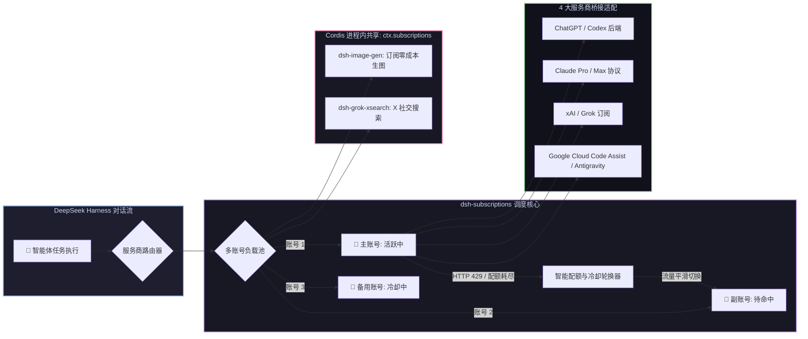

# 📦 @goodandready/dsh-subscriptions

<div align="center">

<h3>DeepSeek Harness 个人 AI 订阅桥接、多账号池轮换与零泄漏 OAuth 插件</h3>

<p align="center">
  <a href="https://www.npmjs.com/package/@goodandready/dsh-subscriptions"></a>
  <a href="LICENSE"></a>
  <a href="https://github.com/topics/dsh-plugin"></a>
  <a href="https://nodejs.org"></a>
</p>

<p align="center">
  <a href="https://goodandready.app/"></a>
</p>

<p align="center">
  <a href="README.md"><b>🇬🇧 English</b></a> •
  <a href="README.ru.md"><b>🇷🇺 Русский</b></a> •
  <a href="README.zh.md"><b>🇨🇳 中文说明</b></a>
</p>

</div>

---

## ⚡ 插件概览

**`dsh-subscriptions`** 将您现有的付费个人 AI 订阅无缝接入 **DeepSeek Harness**，作为第一类模型服务商。

无需为日常智能体任务支付昂贵的 API 按量计费。本插件支持标准 OAuth PKCE 鉴权、**单服务商多账号池动态轮换**（遭遇 429 限流时自动秒切可用账号）、**前置配额平滑切换**，并通过**进程内 Cordis 服务 (`ctx.subscriptions`)** 赋能 [`dsh-image-gen`](https://github.com/GooDAnDReaDY/dsh-image-gen) 与 [`dsh-grok-xsearch`](https://github.com/GooDAnDReaDY/dsh-grok-xsearch) 等插件，实现 Token 零网络泄漏。



---

## ✨ 核心功能

### 支持的 16 个内置订阅供应商
| 供应商 | 订阅级别 | 协议 |
|---|---|---|
| `codex` | ChatGPT Plus / Pro | 流式响应、工具调用、图像生成 |
| `claude` | Claude Pro / Max | 原生 Messages 协议、用量跟踪 |
| `grok` | xAI / X Premium | 实时推理、计费检查 |
| `antigravity` | Google Cloud Code Assist | 流式生成 |
| `kimi` | Moonshot Kimi | OAuth Device Flow 登录（`auth.kimi.com`）、OpenAI 兼容聊天 |
| `glm` | Z.ai GLM Coding Plan | GLM 编码端点（`api.z.ai`）、实时配额监控 |
| `cursor` | Cursor | Cursor 后端（`api2.cursor.sh`）、用量面板解析 |
| `kiro` | AWS Kiro | Kiro 桌面 OAuth（`app.kiro.dev`）、流式输出 |
| `copilot` | GitHub Copilot | GitHub Device Flow 登录、Copilot 聊天补全 |
| `qwen` | 阿里 Qwen（DashScope） | OpenAI 兼容端点、API Key 认证 |
| `ernie` | 百度 ERNIE（千帆） | OAuth2 令牌刷新（API Key + Secret Key） |
| `spark` | 讯飞星火 | OpenAI 兼容 HTTP API |
| `jetbrains` | JetBrains AI Assistant | JetBrains AI 中继（`api.jetbrains.ai`） |
| `perplexity` | Perplexity Pro | Sonar 模型目录（`api.perplexity.ai`） |
| `replit` | Replit Core | Replit AI API、connect-token 认证 |
| `cody` | Sourcegraph Cody Pro | Sourcegraph API、access-token 认证 |

### 多账号轮换与限流保护
* 每个供应商可挂多个账号（如 `CODEX_OAUTH_1`、`CODEX_OAUTH_2`）。
* 遇到 429/配额耗尽自动切换到下一个健康账号；支持按剩余量提前切换和动态冷却恢复。

### 安全与无头登录
* OAuth 令牌绝不通过 HTTP API 返回，也不在 Web 界面渲染；仅存放于宿主加密凭据存储。
* **回环自动回调 (`autoLoopback`，`v0.4.9`)**：供应商重定向为回环地址（如 Codex `:1455`）时，插件自动启动临时本地服务器接收回调，无需手动粘贴链接。
* **设备码登录（Codex，`v0.4.9`）**：完全无浏览器的主机上，点击 **Device login**，在任意设备打开 `https://auth.openai.com/codex/device` 输入短码即可完成 PKCE 授权。

### 账号级代理（`v0.4.9`）
* 每个账号可配置独立代理（`http://`、`https://`、`socks5://`）；令牌刷新、供应商检查、模型请求均走该代理。
* 账号卡片内的 **Check proxy** 按钮一键检测代理延迟。

### 本地 Ollama 网关与无缝回退（`v0.4.17`）
* **原生 provider (`ollama`)**：本地 Ollama 可达时（`ollamaBaseUrl`，默认 `http://127.0.0.1:11434`），自动出现在 DSH 原生模型选择器中（模型来自 `/api/tags`），无需密钥。
* **无缝配额回退 (`ollamaFallback`，默认开启)**：某供应商的所有账号耗尽或不可达且尚未输出任何内容时，对话自动切换到本地模型（`ollamaFallbackModel` 或 `/api/tags` 第一个模型），并记录到请求历史（`kind: fallback`）。
* 免费（$0）应急通道：无网络、无配额也能用。

### Effort、Verbosity 与 Fast Mode（`v0.4.17`）
* **推理力度 (Effort)**：Codex 模型从实时目录上报支持的力度等级，原生选择器校验后以 `reasoning.effort` 传入 `/responses` 协议；Grok 按自身目录过滤转发。
* **详略程度 (`codexVerbosity`)**：`low`/`medium`/`high` 以 `text.verbosity` 传给 Codex 推理模型；留空为协议默认。
* **Fast Mode (`codexFastMode`)**：每次 Codex 请求携带 `service_tier: priority`（1.5x 速度计费档）；启用时活动订阅芯片显示 `⚡`。

### 按模型家族的冷却与模型过滤（`v0.4.17`）
* **Reasoning 与 Standard 分离**：推理模型（claude `*thinking*`、grok `*reasoning*`、全部 codex 模型）触发 429 时，只冷却该账号的 reasoning 家族——同账号的 standard 模型立即可用；旧版冷却仍按整账号生效。
* **隐藏过时模型 (`hideDeprecatedModels`)**：从原生选择器中过滤 `test`/`preview`/`dev`/`alpha`/`beta`/`legacy` 模型 id（同时作用于实时目录与静态回退）。

### 隐私模式与诊断报告（`v0.4.9`）
* **`privacyMask`**：一个开关即可在整个界面隐藏个人数据（邮箱显示为 `j***n@example.com`），服务端遮蔽，适合屏幕共享。
* **匿名诊断报告**：设置卡片内一键生成（插件/运行时版本、系统、各供应商健康状态、HTTP 状态聚合、最近错误与耗时、非敏感配置）并自动复制到剪贴板；令牌、邮箱、凭据名与代理地址严格排除。
* 同区块提供问题追踪器链接，便于提交 issue。

### HTTP API 路由（`v0.4.9`）
| 路由 | 方法 | 用途 |
|---|---|---|
| `/dsh-subscriptions/diagnostics` | GET | 匿名诊断报告（无密钥、无令牌、无代理地址） |
| `/dsh-subscriptions/proxy-check` | POST | 检测槽位代理到供应商基础地址的延迟 |
| `/dsh-subscriptions/oauth/device/start` | POST | 发起 Codex 设备码登录（返回用户码与验证地址） |
| `/dsh-subscriptions/oauth/device/poll` | POST | 轮询设备码授权状态 |

---

## 📦 安装指南

```bash
dsh plugin --profile web add @goodandready/dsh-subscriptions
```

---

## 🧠 Claude 自适应思考与推理深度控制 (v0.6.7 新增)

支持 Anthropic 自适应思考 (`thinking: { type: "adaptive" }`) 及推理深度调节 (`output_config: { effort }`):
- **模型支持**: 针对 Opus 4.6+、Opus 4.7+、Opus 5 (`low`, `medium`, `high`, `xhigh`, `max`) 及 Sonnet 4.6+、Sonnet 5 (`low`, `medium`, `high`) 自动提供对应推理级别。
- **安全降级**: 不支持自适应思考的模型（如 Haiku、Fable、4.5 及更早版本）保持原始请求，防止出现 400 Bad Request 错误。
- **动态目录**: 模型列表自动暴露 `reasoning.efforts`，供 DeepSeek Harness 界面选择。

---

## 🌐 完整双语支持 (EN / ZH) 与单账户健康探活 (v0.6.8 新增)

- **原生双语支持**: 内置 UI 字典全面提供英语 (`en`) 与简体中文 (`zh`) 翻译，所有服务商获取令牌指引均具备中英双语版。
- **解耦外部翻译**: 俄语等其他语种由独立语言包插件（如 `dsh-russian-lang`）在运行时翻译，插件源码保持纯净零硬编码。
- **单账户实时探活与延迟测量**: 槽位中的“检测”按钮实时测量对应订阅账户的双向响应延迟 (`latencyMs`) 与健康状态。

---

## 🚀 一键插件自更新与稳定性强化 (v0.6.9 新增)

- **宿主端一键更新**: 挂载于 `/dsh-subscriptions/update` 的就地更新机制，自动对比 npm registry 最新版本并通过宿主 DSH CLI 执行单飞安装 (`dsh plugin add --config.minimumReleaseAge=0`)。
- **安全与来源防护**: 更新接口严格校验环回地址（支持 IPv4 `127.0.0.1`、IPv6 `::1`、`localhost`）、`x-dsh-plugin-update` 请求头及同源策略，阻断未授权跨站调用。
- **状态栏徽章与更新按钮**: 设置面板顶部状态栏显示当前插件版本，有新版本时提示告警徽章并提供一键更新按钮与重启提示。
- **网络超时熔断**: 配额检测与冒烟测试增加 15 秒超时信号保护 (`AbortSignal.timeout(15_000)`)，防止外部服务商接口故障导致请求挂起。
- **参数容错与逻辑去重**: 状态接口兼容 `provider || vendor` 与 `index || accountIndex` 参数别名，并消除 `lib/accounts.js` 中的重复配额通知循环。

---

---

## 🛡️ Token 用量规范化与会话投影修复 (v0.6.12 新增)

- **会话投影崩溃修复 (GitHub #4)**：修复了使用 ChatGPT Codex 及其他流式模型时，首次回复后会话损坏、刷新页面报错 `received NaN, expected number on uncachedInputTokens and outputTokens` 且无法加载的问题。
- **全格式通用 TokenUsage 转换**：在所有流式传输通道（`codexResponsesStream`、`openaiChatStream`、`anthropicStream`、`googleStream`）中引入统一的 `toTokenUsage()` 转换逻辑，将各服务商的原始用量数据标准化为 DSH 规范的 `TokenUsage` 接口（`inputTokens`、`outputTokens`、`cacheReadTokens`、`cacheWriteTokens`、`reasoningTokens`、`totalTokens`）。
- **严格非负整数保底与独立缓存计算**：对所有 token 计数实施严格的非负整数约束（保底为 `0`，杜绝 `NaN` 与 `undefined`）。针对将缓存合并计入总 prompt 的供应商自动执行拆分，确保输入 token 数的准确性。
- **适配器层纵深防御**：在 `SubscriptionAdapter` 中新增用量数据过滤与净化机制，从根源上阻止异常用量流入 DSH 会话持久化与状态恢复流程。

---

## 🔒 OAuth Client ID 校验保护与控制台地址更新 (v0.6.11 新增)

- **Google OAuth Client ID 校验保护 (GitHub #2)**：uildAuthorizeUrl 和 ntigravity.authorizeUrl 严格要求非空 clientId。未配置时服务端返回明确的 HTTP 400 (missing_client_id)，前端界面提示用户在插件设置中填写 ntigravityClientId 或使用“📥 从 CLI 导入”，避免浏览器跳转至 Google OAuth 400 报错页面。
- **配置架构新增密钥项**：在插件 Config 架构中新增 ntigravityClientSecret，方便用户在设置中配置客户端密钥，并在公共接口中自动脱敏脱密。
- **智谱 GLM 控制台地址迁移 (GitHub #3)**：将智谱 GLM 授权与 API Key 获取链接更新为最新控制台有效路由 (https://bigmodel.cn/usercenter/proj-mgmt/apikeys)，彻底解决因服务商控制台路由调整导致的 404 错误。

---

## 🛡️ 稳定性与代码质量强化 (v0.6.10 新增)

- **结构化异常降级**: 全面移除运行时空 catch 块，统一采用带诊断日志的 `bestEffort` 安全兜底机制。
- **原生上下文日志**: 所有日志统一接入 Cordis 规范子系统 `ctx.logger('subscriptions')`。
- **外部网络超时保护**: 为所有模型商 API 网络调用（`listModels`、`fetchFor`、`quotaFetch`、`jsonTokenRequest`）建立 `fetchWithTimeout` 与 `AbortSignal.timeout` 超时熔断保护。
- **设计系统主题对齐**: 将 `client.js` 中的静态样式硬编码替换为 DeepSeek Harness 原生 CSS 主题令牌（`--dsw-alias-*`、`color-mix`），彻底消除独立的 `rgba` 颜色。
- **客户端依赖注入显式化**: 在 `package.json` 清单中显式声明前端所需平台注入项（`@deepseek-ai/dsh-client-locale` 与 `@deepseek-ai/dsh-client-ui-slots`）。
- **公开仓库卫生规范**: 将内部研发指令与计划文件移出 Git 跟踪并加入 `.gitignore`，确保公开版本干净无私有残余。

---

## 🌐 本地化

插件源语言仅为英语。俄语及其他翻译由独立的语言插件（如俄化插件）在运行时对注册的本地化键进行翻译，包本身不内置翻译（Changed in 0.6.1）。

---

## 📄 开源协议

MIT © [GooDAnDReaDY](https://github.com/GooDAnDReaDY)

本 fork 可与 dsh-plugin-subscriptions 同时使用。模型路由采用 subscriptions- 前缀，设置入口为“扩展订阅”，账号保存在独立凭据库。Claude 请求不包含 mcp_probe。线上密码网关仅允许管理员管理共享订阅账号。fork 构建（`-dsh.` 版本）通过本地 tarball 安装，一键更新只显示当前版本，不会安装上游 npm 发行版。

0.6.17 fork 增加中英文账号健康与额度表，以及加密备份导入、导出接口。导入会在写入凭据前校验声明的账号槽位，写入失败会明确报错；线上网关仅允许管理员访问这些接口。`cascadingFallback` 默认关闭；启用聊天回退后，同一请求最多尝试每个服务商一次，取消或请求参数错误不触发跨服务商请求，已输出内容后不再切换重写。

上游提供了预热状态转换、消耗速率计算和告警辅助函数，但本版尚未把自动预热、速率采集与 webhook 触发接入账号生命周期。健康表显示已记录的健康度与额度，不代表自动恢复或剩余可用时长预测已启用。

公共配置读取会隐藏代理密码、自定义供应商密钥和认证请求头。保存未改动的脱敏值时，保留同一账号或供应商已有的密钥；修改账号或已脱敏的代理地址时，需要重新输入凭据。Antigravity 客户端密钥继续支持配置和脱敏。设置读取和代理请求要求浏览器同源请求或已验证的本机回环连接。
